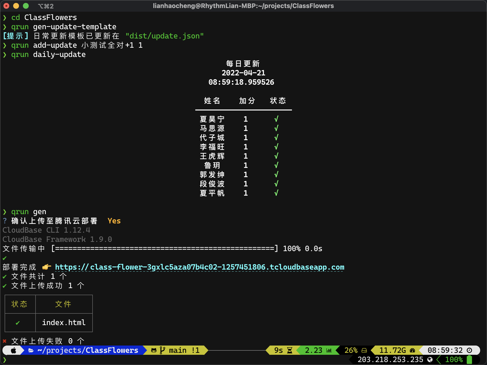

# 小红花榜

为你的班级制作一个小红花榜，生成HTML并自动上传至腾讯云开发的静态网页部署。

预览：https://flowers.rhythmlian.cn/

## 准备

### 腾讯云资源申请

1. 前往[腾讯云开发平台](https://console.cloud.tencent.com/tcb)创建一个你的项目，选择“空模板”创建即可。
2. 创建完成后进入环境，点击左侧的“静态网站托管”，并开通服务。
3. 在左侧`环境 > 环境总览`处记录下你的“环境ID”。
4. 跟随[CLI教程](https://docs.cloudbase.net/cli-v1/install)安装命令`tcb`。
5. 在命令行中执行`tcb login`将自动打开你的浏览器，确认登录即可。

### 在本地部署本项目

```shell
git clone https://github.com/Rhythmicc/ClassFlower.git
```

1. 编辑`main.py`中的`className`，将其设置为你的班级名称。
2. 编辑`main.py`中的`tcb_env_id`，将其设置为你的腾讯云环境ID。

### 开始安装

```sh
pip3 install -r requirements.txt
```

执行`python3 -m src.tables.create_db`，在`dist/flower.db`处生成一个默认sqlite数据库。

## 使用方式



1. `qrun gen-update-template`将生成一个空模板，位置在`dist/update.json`，按照如下格式填写：

   ```json
   {
    "stars": {
       "AAA": -1,
       "BBB": 1,
       "CCC": -1,
       "DDD": 1
    },
    "contents": ["三月七日表现不好同学-1",  "表现好的同学+1"]
   }
   ```

   或使用`qrun add-update <加分原因> <整数> [--names <以逗号分隔的多个姓名>]`命令自动添加，`--names`选项未设置时，默认从粘贴板中获取姓名列表，此外如果json文件中已经存在相应姓名，执行`add-update`会在原有值基础上进行增减。

2. `qrun daily-update`将模板中数据导入数据库。

   - 如需未出现在数据库中的名字被自动添加：`qrun daily-update --disable_auto_insert 0`

3. `qrun gen`生成HTML文件到`public`文件夹，确认上传即可。
